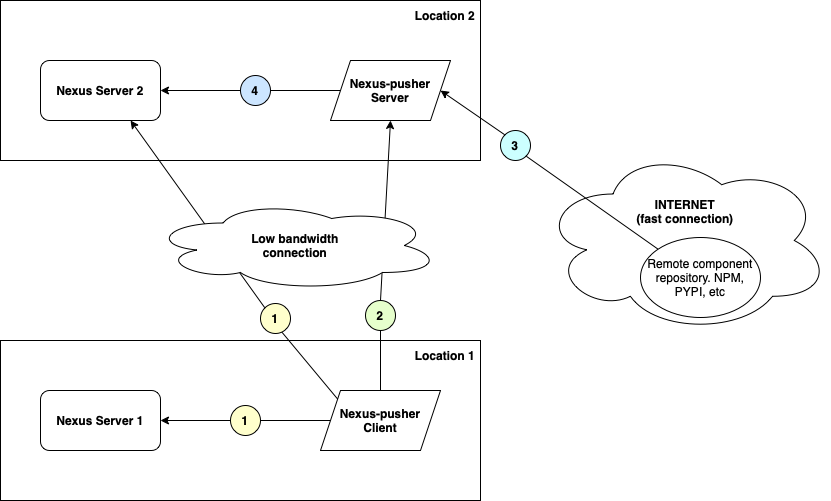

# Nexus-pusher

Synchronise Sonatype Nexus repositories.

## Description

Nexus-pusher is a simple client\server application written in Go, to synchronise Sonatype Nexus repositories\
between two Nexus servers in split environments.

The goal is to be able to do repo sync without actually send assets data from one server to another\
to save bandwidth.



### How it works
1. Nexus-pusher client is requesting full list of assets for specified repositories from Nexus Server 1 and Nexus Server 2 and find differences between them.
2. Nexus-pusher client sends diff from step one to Nexus-pusher server.
3. Nexus-pusher server analyze diff and download all assets from external repository (i.e https://registry.npmjs.org/, etc).
4. Nexus-pusher server upload all downloaded assets to Nexus Server 2

## Getting Started

### Supported repository types:
* NPM (type: npm)
* PYPI (type: pypi)
* MAVEN2 (type: maven2)
* NUGET (type: nuget)

### Installing

* 

### Executing program

* How to run the program
* Step-by-step bullets
```
code blocks for commands
```

### Configuration examples
#### Server:
```yaml
server:
  bindAddress: "0.0.0.0"
  port: "8181"
  concurrency: 1
  credentials:
    test: "test"
  tls:
    auto: false
    domainName: "somedomain.org"
    enabled: false
    keyPath: "key"
    certPath: "cert"
```
* **concurrency** - how many parallel workers will be spawn
* **credentials** - list of 'user/password' to server auth
* **tls.auto** - enable Let's Encrypt cert generation (following domainName)
* **tls.domainName** - domain name for Let's Encrypt cert generation
* **enabled** - enables TLS server listening
* **keyPath** - absolute location of private key file
* **certPath** - absolute location of certificate file

#### Client:
```yaml
client:
    daemon:
        enabled: true
        syncEveryMinutes: 30
    server: "http://X.X.X.X:8181"
    serverAuth:
        user: "test"
        pass: "test"
    syncGlobalAuth:
      srcServer: "https://nexus.some"
      srcServerUser: "user"
      srcServerPass: "pass"
      dstServer: "https://nexus2.some"
      dstServerUser: "user"
      dstServerPass: "pass"
    metrics:
      enabled: true
      endpointPort: 9090
      endpointUri: "/metrics"
    syncConfigs:
        - srcServerConfig:
            # Global parameters (from 'syncGlobalAuth') will be used here for server config
            repoName: "npm-repo1"
          dstServerConfig:
            # Overwrite global server parameters (from 'syncGlobalAuth')
            server: "https://nexus-specific.some"
            user: "user-specific"
            pass: "pass-specific"
            repoName: "npm-repo2"
          format: "npm"
        - srcServerConfig:
            repoName: "maven-repo1"
          dstServerConfig:
            repoName: "maven-repo2"
          format: "maven2"
          artifactsSource: "https://repo1.maven.org/maven2/"
```
* **daemon.enabled** - run client in daemon mode to sync periodically
* **daemon.syncEveryMinutes** - time in minutes to schedule re-sync
* **server** - address of nexus-pusher server
* **syncGlobalAuth** - global default parameters for all syncConfigs elements
* **metrics.enabled** - start exporting client metrics in prometheus format
* **metrics.endpointPort** - port where metrics will be exposed (Default: 9090)
* **metrics.endpointUri** - uri path for metrics exporter (Default: /metrics)
* **serverAuth.user** - username for nexus-pusher server auth
* **serverAuth.pass** - password for nexus-pusher server auth
* **syncConfigs** - list of 'src' and 'dst' pairs of nexus servers to be synced
* **format** - format of artifacts to be synced ('npm', 'pypi', 'maven2')
* **artifactsSource** - source of artifacts to feed nexus-pusher server

## Help

### Environment variables
* **NEXUS_PUSHER_LOG_LEVEL** - set log level at startup.\
Supported values:
  * debug
  * error
  * info (default)
  * warn

## Authors

Contributors names and contact info

ex. Eugene Khokhlov
ex. [@rageofgods](https://github.com/rageofgods)

## Version History

* 0.1
    * Initial Release
* 0.5
    * NPM support implemented
* 1.0
    * PYPI support implemented
* 1.1
    * MAVEN2 support implemented
* 1.2
    * NUGET support implemented 

## License

This project is licensed under the GNU License - see the LICENSE.md file for details
